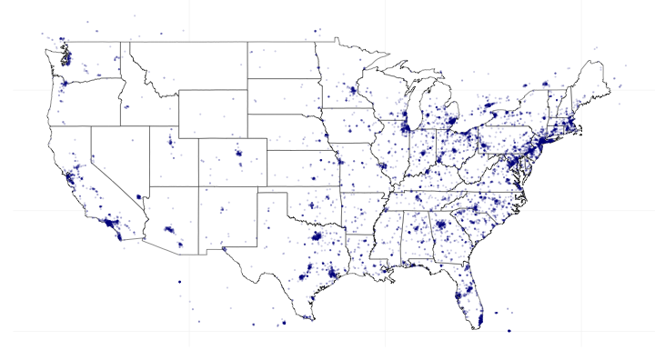

streamR: Access to Twitter Streaming API via R
---------

This package includes a series of functions that give R users access to Twitter&#39;s <a href="https://dev.twitter.com/docs/streaming-apis">Streaming API</a>, as well as a tool that parses the captured tweets and transforms them in R data frames, which can then be used in subsequent analyses. <code>streamR</code> requires authentication via OAuth and the <code>ROAuth</code> package.</p>

Current CRAN release is 0.2.1. To install the most updated version (0.4.0) from GitHub, type:

```
library(devtools)
devtools::install_github("pablobarbera/streamR/streamR")
```

Click <a href="http://github.com/pablobarbera/streamR/blob/master/streamR-manual.pdf?raw=true">here</a> to read the documentation and <a href="http://pablobarbera.com/blog/archives/1.html">here</a> to read the vignette.

<h3>Installation and authentication</h3>

<p>streamR can be installed directly from CRAN, but the most updated version <a href="https://github.com/pablobarbera/streamR">will always be on GitHub</a>. The code below shows how to install from both sources.</p>

```
install.packages("streamR")  # from CRAN
devtools::install_github("pablobarbera/streamR/streamR") # from GitHub
```

<p><code>streamR</code> requires authentication via OAuth. The same oauth token can be used for both <code>twitteR</code> and <code>streamR</code>. After 
creating an application <a href="https://dev.twitter.com/apps/new">here</a>, and obtaining the consumer key and consumer secret, it is easy to create your own oauth credentials using the <code>ROAuth</code> package, which can be saved in disk for future sessions:</p>

```
library(ROAuth)
requestURL <- "https://api.twitter.com/oauth/request_token"
accessURL <- "https://api.twitter.com/oauth/access_token"
authURL <- "https://api.twitter.com/oauth/authorize"
consumerKey <- "xxxxxyyyyyzzzzzz"
consumerSecret <- "xxxxxxyyyyyzzzzzzz111111222222"
my_oauth <- OAuthFactory$new(consumerKey = consumerKey, consumerSecret = consumerSecret, 
    requestURL = requestURL, accessURL = accessURL, authURL = authURL)
my_oauth$handshake(cainfo = system.file("CurlSSL", "cacert.pem", package = "RCurl"))
save(my_oauth, file = "my_oauth.Rdata")
```

Alternatively, you can also create an access token as a list and <code>streamR</code> will automatically do the handshake:

```
 my_oauth <- list(consumer_key = "CONSUMER_KEY",
   consumer_secret = "CONSUMER_SECRET",
   access_token="ACCESS_TOKEN",
   access_token_secret = "ACCESS_TOKEN_SECRET")
```

<h3>filterStream</h3>

<p><code>filterStream</code> is probably the most useful function. It opens a connection to the <a href="https://dev.twitter.com/docs/api/1.1/post/statuses/filter">Streaming API</a> that will return all tweets that contain one or more of the keywords given in the <code>track</code> argument. We can use this function to, for instance, capture public statuses that mention Obama or Biden:</p>

<pre><code class="r">library(streamR)
</code></pre>

<pre><code>## Loading required package: RCurl
## Loading required package: bitops
## Loading required package: rjson
</code></pre>

<pre><code class="r">load(&quot;my_oauth.Rdata&quot;)
filterStream(&quot;tweets.json&quot;, track = c(&quot;Obama&quot;, &quot;Biden&quot;), timeout = 120, 
  oauth = my_oauth)
</code></pre>

<pre><code>## Loading required package: ROAuth
## Loading required package: digest
## Capturing tweets...
## Connection to Twitter stream was closed after 120 seconds with up to 350 tweets downloaded.
</code></pre>

<pre><code class="r">tweets.df &lt;- parseTweets(&quot;tweets.json&quot;, simplify = TRUE)
</code></pre>

<pre><code>## 350 tweets have been parsed.
</code></pre>

<p>Note that here I&#39;m connecting to the stream for just two minutes, but ideally I should have the connection continuously open, with some method to handle exceptions and reconnect when there&#39;s an error. I&#39;m also using OAuth authentication (see below), and storing the tweets in a data frame using the <code>parseTweets</code> function. As I expected, Obama is mentioned more often than Biden at the moment I created this post:</p>

<pre><code class="r">c( length(grep(&quot;obama&quot;, tweets.df$text, ignore.case = TRUE)),
   length(grep(&quot;biden&quot;, tweets.df$text, ignore.case = TRUE)) )
</code></pre>

<pre><code>## [1] 347  2
</code></pre>

<p>Tweets can also be filtered by two additional parameters: <code>follow</code>, which can be used to include tweets published by only a subset of Twitter users, and <code>locations</code>, which will return geo-located tweets sent within bounding boxes defined by a set of coordinates. Using these two options involves some additional complications &ndash; for example, the Twitter users need to be specified as a vector of user IDs and not just screen names, and the <code>locations</code> filter is incremental to any keyword in the <code>track</code> argument. For more information, I would suggest to check Twitter&#39;s <a href="http://dev.twitter.com/docs/streaming-apis/parameters">documentation</a> for each parameter.</p>

<p>Here&#39;s a quick example of how one would capture and visualize tweets sent from the United States:</p>

<pre><code class="r">filterStream(&quot;tweetsUS.json&quot;, locations = c(-125, 25, -66, 50), timeout = 300, 
    oauth = my_oauth)
tweets.df &lt;- parseTweets(&quot;tweetsUS.json&quot;, verbose = FALSE)
library(ggplot2)
library(grid)
map.data &lt;- map_data(&quot;state&quot;)
points &lt;- data.frame(x = as.numeric(tweets.df$lon), y = as.numeric(tweets.df$lat))
points &lt;- points[points$y &gt; 25, ]
ggplot(map.data) + geom_map(aes(map_id = region), map = map.data, fill = &quot;white&quot;, 
    color = &quot;grey20&quot;, size = 0.25) + expand_limits(x = map.data$long, y = map.data$lat) + 
    theme(axis.line = element_blank(), axis.text = element_blank(), axis.ticks = element_blank(), 
        axis.title = element_blank(), panel.background = element_blank(), panel.border = element_blank(), 
        panel.grid.major = element_blank(), plot.background = element_blank(), 
        plot.margin = unit(0 * c(-1.5, -1.5, -1.5, -1.5), &quot;lines&quot;)) + geom_point(data = points, 
    aes(x = x, y = y), size = 1, alpha = 1/5, color = &quot;darkblue&quot;)
</code></pre>

<center></center>

<h3>sampleStream</h3>

<p>The function <code>sampleStream</code> allows the user to capture a small random sample (around 1%) of all tweets that are being sent at each moment. This can be useful for different purposes, such as estimating variations in &ldquo;global sentiment&rdquo; or describing the average Twitter user. A quick analysis of the public statuses captured with this method shows, for example, that the average (active) Twitter user follows around 500 other accounts, that a very small proportion of tweets are geo-located, and that Spanish is the second most common language in which Twitter users set up their interface.</p>

<pre><code class="r">sampleStream(&quot;tweetsSample.json&quot;, timeout = 120, oauth = my_oauth, verbose = FALSE)
tweets.df &lt;- parseTweets(&quot;tweetsSample.json&quot;, verbose = FALSE)
mean(as.numeric(tweets.df$friends_count))
</code></pre>

<pre><code>## [1] 543.5
</code></pre>

<pre><code class="r">table(is.na(tweets.df$lat))
</code></pre>

<pre><code>## 
## FALSE  TRUE 
##   228 13503
</code></pre>

<pre><code class="r">round(sort(table(tweets.df$lang), decreasing = T)[1:5]/sum(table(tweets.df$lang)), 2)
</code></pre>

<pre><code>## 
##   en   es   ja   pt   ar 
## 0.57 0.16 0.09 0.07 0.03
</code></pre>

<h3>userStream</h3>

<p>Finally, I have also included the function <code>userStream</code>, which allows the user to capture the tweets they would see in their timeline on <a href="http://www.twitter.com">twitter.com</a>. As was the case with <code>filterStream</code>, this function allows to subset tweets by keyword and location, and exclude replies across users who are not followed. An example is shown below. Perhaps not surprisingly, many of the accounts I follow use Twitter in Spanish.</p>

<pre><code class="r">userStream(&quot;mytweets.json&quot;, timeout = 120, oauth = my_oauth, verbose = FALSE)
tweets.df &lt;- parseTweets(&quot;mytweets.json&quot;, verbose = FALSE)
round(sort(table(tweets.df$lang), decreasing = T)[1:3]/sum(table(tweets.df$lang)), 2)
</code></pre>

<pre><code>## 
##   en   es   ca 
## 0.62 0.30 0.08
</code></pre>

<h3>More</h3>

<p>In these examples I have used <code>parseTweets</code> to read the captured tweets from the text file where they were saved in disk and store them in a data frame in memory. The tweets can also be stored directly in memory by leaving the <code>file.name</code> argument empty, but my personal preference is to save the raw text, usually in different files, one for each hour or day. Having the files means I can run UNIX commands to quickly compute the number of tweets in each period, since each tweet is saved in a different line:</p>

<pre><code class="r">system(&quot;wc -l &#39;tweetsSample.json&#39;&quot;, intern = TRUE)
</code></pre>

<pre><code>## [1] &quot;   15086 tweetsSample.json&quot;
</code></pre>

<h3>Concluding...</h3>

<p>I hope this package is useful for R users who want to at least play around with this type of data. Future releases of the package will include additional functions to analyze captured tweets, and improve the already existing so that they handle errors better. My plan is to keep the <a href='https://github.com/pablobarbera/Rfacebook'>GitHub version</a> up to date fixing any possible bugs, and release only major versions to CRAN.</p>

<p>You can contact me at pablo.barbera[at]nyu.edu or via twitter (<a href="http://www.twitter.com/p_barbera">@p_barbera</a>) for any question or suggestion you might have, or to report any bugs in the code.</p>


